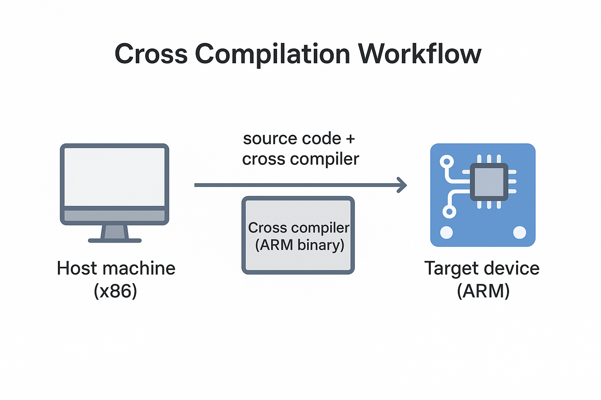
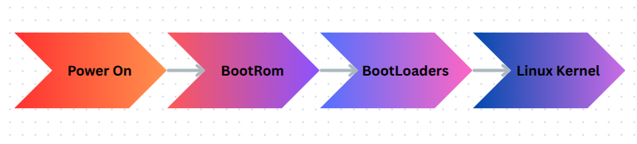

**Introduction to Embedded Linux**
=============================================
Before we dive into the technical details, let's face it—like every technical book, 
we need to start from the very beginning and understand how Linux was created. 
I know, this might just be the most boring part of the entire book for some, but 
to make my book appear more professional, I need to include the history of Linux. 
Let's treat this section as the "Roman phase" of the book—necessary, foundational, 
and perhaps a little lengthy.

1.1 History of Linux
--------------------

Linux originated in 1991 when Linus Torvalds, a computer science student
at the University of Helsinki, announced that he was developing a free
operating system kernel as a personal project. His goal was to create a
system similar to MINIX, a Unix-like operating system developed by
Andrew S. Tanenbaum, but with expanded functionality and open
collaboration.

Early Development (1991–1993)
~~~~~~~~~~~~~~~~~~~~~~~~~~~~~

Initially, Torvalds released Linux under a restrictive license, limiting
commercial use. However, he soon adopted the GNU General Public License
(GPL), which allowed the code to be freely shared, modified, and
distributed. This move rapidly accelerated Linux's growth by fostering
community contributions.

Key milestones in this early phase:

-  **Version 0.01 (1991)**: First publicly announced kernel, featuring
   basic process scheduling and file systems.
-  **Version 0.12 (1992)**: GPL licensing begins, increasing adoption
   and community participation.
-  **Version 0.99 (1993)**: Significant improvements in stability,
   introducing networking support (TCP/IP), enhancing its suitability
   for broader use.

Rise of Linux (1994–2000)
~~~~~~~~~~~~~~~~~~~~~~~~~

Throughout the mid to late 1990s, Linux evolved dramatically. Major tech
companies recognized its potential, and distributions like Slackware,
Debian, and Red Hat emerged, making Linux accessible to broader
audiences.

Key developments:

-  **Linux 1.0 (1994)**: Marked Linux’s official transition from
   hobbyist tool to stable, reliable OS kernel suitable for production
   use.
-  **Linux 2.0 (1996)**: Introduced support for symmetric
   multiprocessing (SMP), vastly expanding Linux’s usability on
   multi-processor systems.
-  **Commercial Interest**: IBM, Oracle, and other industry giants began
   investing in Linux, fueling rapid growth and enterprise credibility.

Linux Matures (2001–2010)
~~~~~~~~~~~~~~~~~~~~~~~~~

In the early 2000s, Linux penetrated deeply into enterprise
environments, driven by stability, scalability, and security.

Key milestones:

-  **Linux 2.4 (2001)**: Improved scalability and hardware support, used
   extensively in servers and embedded systems.
-  **Linux 2.6 (2003)**: Significant architectural improvements,
   enhanced support for threading, real-time applications, and embedded
   systems.
-  **Enterprise Adoption**: Major deployments by Google, Amazon, and
   Facebook firmly established Linux in global infrastructure.

Modern Linux Era (2011–Present)
~~~~~~~~~~~~~~~~~~~~~~~~~~~~~~~

Today, Linux powers everything from smartphones (Android), embedded
devices, IoT systems, automotive infotainment systems, to virtually all
of the world's supercomputers.

Key developments:

-  **Linux 3.x–6.x**: Continuous performance enhancements, security
   improvements, and wider hardware compatibility.
-  **Embedded Linux**: Growth in embedded markets, driven by projects
   like Raspberry Pi, Arduino (Linux-based variants), and platforms like
   Android and Yocto.
-  **Community and Corporate Synergy**: Modern Linux development
   combines extensive community participation with corporate backing
   (Intel, Red Hat, Google), resulting in rapid innovation.

This history underlines how Linux transitioned from a modest student
project to a global technological cornerstone, especially vital in the
embedded systems domain.

1.2 Domains and Industries Utilizing Linux
------------------------------------------

Linux's flexibility and open-source nature have enabled its widespread
adoption across diverse industries and domains. Here are some primary
sectors:

-  **Servers and Data Centers**: Linux dominates server environments,
   powering web hosting, cloud computing platforms such as Amazon Web
   Services (AWS) and Google Cloud, and enterprise infrastructures.

   .. figure:: images/Pictures/1000000000000514000003628CFBB2C7D516C3F2.png
      :alt: Figure 1: Data Center
      :width: 3.6311in
      :height: 2.8728in

      Figure 1: Data Center

-  **Mobile and Embedded Devices**: Android, built on the Linux kernel,
   runs billions of smartphones and tablets worldwide. Embedded devices,
   such as smart TVs, routers, and IoT devices, extensively utilize
   Linux for its reliability and adaptability.

   Figure 2: SmartPhone

-  **Automotive Industry**: Linux is increasingly utilized in automotive
   systems, particularly in infotainment and navigation systems through
   platforms like Automotive Grade Linux (AGL).
-  **Supercomputing and Research**: Linux powers the majority of the
   world's fastest supercomputers, facilitating cutting-edge scientific
   research and computational tasks.
-  **Industrial and Automation**: In industrial environments, Linux
   provides robust control systems for manufacturing processes,
   robotics, and automation tasks.

Example: Open Source Contributions
~~~~~~~~~~~~~~~~~~~~~~~~~~~~~~~~~~

One notable example highlighting Linux's adoption is the Raspberry Pi—a
versatile, low-cost computing platform that leverages Linux for
educational purposes, DIY projects, and commercial applications.

The Raspberry Pi exemplifies the power of Linux to democratize
computing, encouraging widespread innovation and community
participation.

1.3 Overview of Linux Kernel Architecture and Its Modularity
------------------------------------------------------------

The Linux kernel is the core component of a Linux operating system,
acting as a bridge between software applications and the physical
hardware of the computer. It manages hardware resources, enabling
multiple applications to run concurrently.

Kernel Architecture
~~~~~~~~~~~~~~~~~~~

The Linux kernel has a monolithic architecture, meaning all kernel
services run within a single kernel space. However, it offers modularity
through loadable kernel modules (LKMs), allowing dynamic addition and
removal of functionalities without needing to reboot.

Main Components of the Linux Kernel:
~~~~~~~~~~~~~~~~~~~~~~~~~~~~~~~~~~~~

-  **Process Management**: Handles scheduling and execution of
   processes.
-  **Memory Management**: Manages RAM, virtual memory, paging, and
   protection.
-  **File Systems**: Provides abstraction for storing and organizing
   data.
-  **Device Drivers**: Software interfaces to hardware devices, enabling
   communication and control.
-  **Networking Stack**: Implements various network protocols and
   manages network connections.

Modularity Through Loadable Modules
~~~~~~~~~~~~~~~~~~~~~~~~~~~~~~~~~~~

Linux kernel modules (LKMs) are key to the kernel’s flexibility,
allowing functionalities such as device drivers or file systems to be
loaded and unloaded dynamically. This modularity reduces memory
footprint and increases flexibility and efficiency, essential in
embedded environments.

This architecture and modularity are foundational to Linux’s
adaptability across numerous computing platforms, from powerful servers
to small embedded devices.

1.4 Differences Between General-purpose Linux Distributions and Embedded Linux Systems
--------------------------------------------------------------------------------------

Linux, the open-source operating system kernel pioneered by Linus
Torvalds, has evolved far beyond its origins into a global ecosystem
powering everything from supercomputers to smartwatches. Its
adaptability lies in two key realms: **general-purpose distributions**,
which cater to desktops, servers, and everyday computing, and **embedded
Linux**, which drives specialized, often invisible systems in devices we
interact with daily. While distributions like Ubuntu or Fedora
prioritize user-friendliness and software abundance, embedded Linux
strips away excess to deliver efficiency and reliability in constrained
environments like medical devices, routers, and industrial controllers.
Understanding these branches reveals how Linux’s modular design supports
both the visible and invisible pillars of modern technology.

**Linux Distribution:**
A Linux distribution is a complete operating system built around the Linux kernel, combined with a collection of software, package managers, and system tools. Each distribution (or "distro") packages the kernel with different applications, desktop environments, and configurations to serve specific needs, such as general-purpose computing, server deployment, security, or lightweight performance. Popular examples include Ubuntu, Fedora, Debian, and Arch Linux.
~~~~~~~~~~~~~~~~~~~~~~~~~~~~~~~~~~~~~~~~~~~~~~~~~~~~~~~~~~~~~~~~~~~~~~~~~~~~~~~~~~~~~~~~~~~~~~~~~~~~~~~~~~~~~~~~~~~~~~~~~~~~~~~~~~~~~~~~~~~~~~~~~~~~~~~~~~~~~~~~~~~~~~~~~~~~~~~~~~~~~~~~~~~~~~~~~~~~~~~~~~~~~~~~~~~~~~~~~~~~~~~~~~~~~~~~~~~~~~~~~~~~~~~~~~~~~~~~~~~~~~~~~~~~~~~~~~~~~~~~~~~~~~~~~~~~~~~~~~~~~~~~~~~~~~~~~~~~~~~~~~~~~~~~~~~~~~~~~~~~~~~~~~~~~~~~~~~~~~~~~~~~~~~~~~~~~~~~~~~~~~~~~~~~~~~~~~~~~~~~~~~~~~~~~~~~~~~~~~~~~~~~~~~~~~~~~~~~~~~~~~~~~~~~~~~~~~~~~~~~~~

Distributions may vary in their target audience, stability, software
availability, and philosophy (e.g., open-source purity vs. user
convenience). Some are maintained by communities (e.g., Debian), while
others are backed by companies (e.g., Red Hat Enterprise Linux).

A **Linux distribution** (often shortened to *distro*) is a complete
operating-system stack that bundles:

-  the **Linux kernel**;
-  **GNU user-space utilities** (coreutils, bash, grep, etc.);
-  an **init system** (systemd, SysV init, OpenRC, etc.);
-  a **package-management system** (dpkg + APT, RPM + DNF, pacman,
   etc.);
-  a curated **software repository** with thousands of pre-built
   packages;
-  a **release policy & update mechanism** (security fixes, LTS vs
   rolling);
-  optional **desktop environment(s)**, documentation, installers, and
   community or commercial support.

Well-known examples include **Ubuntu**, **Fedora**, **openSUSE**,
**Debian**, **Arch Linux** and **Red Hat Enterprise Linux**. These
distros target *general-purpose* workloads—desktops, laptops, servers,
and cloud VMs—where storage is measured in GBs, RAM in GBs, and a fast
network is assumed.

Embedded Linux:
~~~~~~~~~~~~~~~

The **Linux embedded world** refers to the use of the Linux operating
system in specialized, resource-constrained computing environments where
efficiency, reliability, and low power consumption are critical. Unlike
traditional desktop or server distributions, embedded Linux systems are
tailored for dedicated hardware—such as IoT devices, industrial
machines, medical equipment, networking routers, and automotive
systems—often running without a graphical interface.

What *Embedded Linux* Really Means
~~~~~~~~~~~~~~~~~~~~~~~~~~~~~~~~~~

An **embedded Linux system** is *not* a shrink-wrapped distro. Instead
it is a **custom firmware image** created for one *specific* board or
product. Typically generated by tools such as **Buildroot**,
**Yocto/OpenEmbedded**, **OpenWrt**, or vendor SDKs, it usually
contains:

-  a **tailored kernel** with only the required drivers and subsystems;
-  a minimal C library (**musl** or **uClibc**) instead of glibc;
-  **BusyBox** or **Toybox** replacing hundreds of GNU utilities;
-  a very small init (BusyBox init, runit, systemd-minimal) and maybe an
   *rc script*;
-  read-only or overlay **root-fs** stored in squashfs/UBI;
-  application(s) built in-house, often running as PID 1;
-  OTA update mechanism (A/B partitions, RAUC, SWUpdate) if required.

The driving goals are **footprint, determinism, security, and fast
boot** on hardware that may have:

-  64 MB – 512 MB of RAM,
-  \leq 256 MB of flash/eMMC,
-  no display (headless),
-  tight power or real-time constraints.

Expanded Side-by-Side Comparison
~~~~~~~~~~~~~~~~~~~~~~~~~~~~~~~~

+----------------------+----------------------+----------------------+
| Aspect               | General-Purpose      | Embedded Linux       |
|                      | Linux Distro         | Firmware             |
+----------------------+----------------------+----------------------+
| **Typical storage    | 2 – 8 GB (desktop) / | 8 – 100 MB           |
| footprint**          | 600 MB (server       | (squashfs)           |
|                      | net-install)         |                      |
+----------------------+----------------------+----------------------+
| **Kernel**           | Generic binary with  | Stripped-down,       |
|                      | most drivers = large | board-specific       |
+----------------------+----------------------+----------------------+
| **Init system**      | systemd with dozens  | BusyBox init or      |
|                      | of services          | minimal systemd      |
+----------------------+----------------------+----------------------+
| **Package mgmt**     | APT/RPM/zypper;      | None in production   |
|                      | thousands of         | image (read-only);   |
|                      | packages on demand   | packages built at    |
|                      |                      | image-creation time  |
+----------------------+----------------------+----------------------+
| **Boot time**        | 10 – 60 s typical    | 300 ms – 5 s target  |
+----------------------+----------------------+----------------------+
| **Updates**          | Online pkg updates;  | Full-image atomic    |
|                      | user-initiated or    | OTA; A/B or          |
|                      | automatic            | dual-bank schemes    |
+----------------------+----------------------+----------------------+
| **Example use case** | Ubuntu Server on AWS | Smart thermostat     |
|                      | EC2                  | firmware running     |
|                      |                      | Buildroot            |
+----------------------+----------------------+----------------------+

Concrete Scenario Comparison
~~~~~~~~~~~~~~~~~~~~~~~~~~~~

*Ubuntu 24.04 LTS Server* on an x86-64 cloud VM arrives as a 1.2 GB ISO,
installs ~800 packages, enables OpenSSH, systemd, journald, snapd,
cloud-init, and a full GNU userland. The admin chooses what extra
software to install via *apt*.

A *smart-home thermostat* firmware built with **Buildroot** contains:

-  Linux 6.6 kernel (= 8 MB) with only SPI, I²C, GPIO, and Wi-Fi
   drivers;
-  BusyBox (= 1 MB) providing = 200 Unix commands;
-  a musl C library (= 700 kB);
-  an application written in C++ that talks to sensors and a cloud API;
-  read-only squashfs rootfs (= 22 MB) flashed to NAND;
-  a second inactive partition for safe OTA updates.

Boot time is < 2 s from power-on to UI ready, and total RAM usage is
< 40 MB.

Why the Difference Matters
~~~~~~~~~~~~~~~~~~~~~~~~~~

1. **Footprint & Cost** – Smaller images mean cheaper flash and faster
   updates.
2. **Security Surfac\ e**– Fewer moving parts → fewer CVEs to patch.
3. **Determinism** – No surprise package updates breaking
   reproducibility.
4. **Custom Hardware** – BSP-level tweaks impossible in off-the-shelf
   distros.

These constraints are exactly why **build systems** (Buildroot, Yocto,
OpenWrt) exist: they let engineers *compose* a purpose-built Linux, much
like linking source files into a single firmware binary.

Conclusion:

-  General-purpose Linux distributions (e.g., Ubuntu, Fedora, Debian)
   are designed to cater to a wide range of computing needs, offering
   comprehensive packages, user-friendly interfaces, and extensive
   software repositories. They are optimized for desktop and server
   environments, prioritizing user convenience, flexibility, and ease of
   software management.
-  Embedded Linux systems, on the other hand, are tailored specifically
   for constrained hardware environments such as IoT devices, automotive
   systems, and industrial equipment. They are designed to optimize
   performance, reduce footprint, and minimize resource consumption.

+----------------------+----------------------+----------------------+
| Feature              | General-Purpose      | Embedded Linux       |
|                      | Linux                |                      |
+----------------------+----------------------+----------------------+
| Resource Usage       | High memory and      | Minimal memory and   |
|                      | storage              | storage              |
+----------------------+----------------------+----------------------+
| Kernel Customization | Standard kernel with | Highly customized    |
|                      | broad compatibility  | kernel               |
+----------------------+----------------------+----------------------+
| Boot Time            | Slower, not          | Fast, optimized for  |
|                      | optimized for rapid  | quick booting        |
|                      | booting              |                      |
+----------------------+----------------------+----------------------+
| Package Management   | Robust, extensive    | Minimal, selective   |
|                      | repositories         | package inclusion    |
+----------------------+----------------------+----------------------+
| System Updates       | Frequent updates,    | Less frequent,       |
|                      | large size           | carefully controlled |
+----------------------+----------------------+----------------------+

1.5 Introduction to Cross-Compilation and Toolchains.
-----------------------------------------------------

Developing software for embedded Linux systems introduces a fundamental
challenge: **how to build code on a powerful host machine (like a PC)
that must run on a vastly different target device (like a
microcontroller or ARM-based board)**. This is where
**cross-compilation**, **toolchains**, and **build systems** become
essential.

Cross-compilation allows developers to generate executable binaries for
one architecture (e.g., ARM) while working on another (e.g., x86). This
process relies on a **cross-compilation toolchain**—a specialized set of
compilers, linkers, and libraries tailored for the target hardware.
Meanwhile, **build systems** like Yocto, Buildroot, or CMake automate
the complexity of configuring, compiling, and deploying software across
diverse environments.

Together, these tools form the backbone of embedded Linux development,
enabling efficient, scalable, and portable firmware creation—whether for
IoT devices, industrial controllers, or custom hardware. Understanding
their interplay is crucial for any developer working at the intersection
of software and hardware.

1.5.1 Why Cross-Compile?
~~~~~~~~~~~~~~~~~~~~~~~~

Cross-compilation is the art of **building software on one machine
(the**\ **host**\ **) that will ultimately run on a different machine
(the**\ **target**\ **)**—exactly the situation we face in embedded
Linux work. Because the Raspberry Pi 4 cannot reasonably compile an
entire kernel in a few minutes, we ask your fast x86-64 laptop to do the
heavy lifting.

-  The target often lacks CPU horsepower, RAM, or storage to build large
   projects.
-  A single host can produce firmware for dozens of boards (ARM 32-bit,
   ARM64, RISC-V, MIPS) in a CI pipeline.
-  Build reproducibility: we freeze compiler versions and libraries so
   every image is identical.

**Tip** If you ever see a file named *lib64/ld-musl-aarch64.so.1* on
your PC, that is a cross-built ARM64 library—it will *not* run on
x86-64.

Examples:

   Figure 3: Cross Compilation for Arm target in x86 machine

Here’s a simple visual **figure 3**\ you can drop into slides or docs
when you need to describe cross-compilation:

**How to read it**

1. **Host machine (x86)** – where you edit source code.
2. The **cross-compiler** on that host converts the code into a binary
   for a *different* CPU architecture (here, ARM).
3. The resulting **ARM binary** is transferred (arrow) to the **target
   device (ARM)** for execution.

The clean separation helps audiences grasp why the build happens on one
box while the program runs on another. Let me know if you’d like extra
details (e.g., libraries, sysroot, debug cycle) or a different
style/format!

1.5.2 Toolchains:
~~~~~~~~~~~~~~~~~

A **toolchain** is the foundational set of tools required to transform
source code into executable programs for a target system. In embedded
Linux development, where the host and target architectures often differ,
a properly configured toolchain is critical for successful
cross-compilation. It consists of several interdependent components
working together to compile, assemble, link, and debug software for the
target device.

**Components of a Toolchain**

A typical embedded Linux toolchain includes:

1. **Compiler (GCC or Clang)** – Translates high-level code (C, C++,
   etc.) into machine-specific assembly.
2. **Assembler (GNU as)** – Converts assembly code into binary object
   files.
3. **Linker (GNU ld)** – Combines object files and libraries into a
   final executable.
4. **Libraries (glibc, musl, uClibc)** – Provide system APIs for file
   operations, memory management, and more.
5. **Binary Utilities (binutils)** – Tools like **objcopy**, **strip**,
   and **readelf** for manipulating binaries.
6. **Debugger (GDB)** – Allows low-level debugging of applications
   running on the target.

**Types of Toolchains**

-  **Native Toolchain** – Runs and builds software for the same system
   (e.g., compiling on x86 for x86).
-  **Cross-Toolchain** – Built to generate code for a different
   architecture (e.g., compiling on x86 for ARM).
-  **Bare-Metal Toolchain** – Used for firmware development without an
   OS (e.g., microcontrollers).
-  **SDK Toolchains** – Pre-configured by vendors for specific hardware
   (e.g., Raspberry Pi, Yocto SDK).

**Why Toolchains Matter in Embedded Linux**

Since embedded devices often lack the resources to compile software
natively, cross-toolchains enable development on a powerful host machine
while producing optimized binaries for the target. Choosing the right
toolchain—whether a prebuilt one (like Linaro for ARM) or a custom-built
one (via Crosstool-NG or Buildroot)—impacts performance, binary size,
and compatibility.

Understanding toolchains is essential for troubleshooting build errors,
optimizing code, and ensuring that software runs correctly on
constrained embedded systems. Whether you’re developing for IoT,
industrial automation, or custom hardware, mastering toolchains unlocks
the full potential of embedded Linux.

1.5.3 Practical Mini-Lab — Your First Cross-Compiled **Hello World**
~~~~~~~~~~~~~~~~~~~~~~~~~~~~~~~~~~~~~~~~~~~~~~~~~~~~~~~~~~~~~~~~~~~~

Let’s start with the absolute basics: a single-file C program that
prints **“Hello World!”** and a tiny *Makefile* that uses the
cross-compiler. This gets you comfortable with the toolchain *before* we
jump into full-blown packages.

Step 1 — Create the Source File
^^^^^^^^^^^^^^^^^^^^^^^^^^^^^^^

Create a new directory on your host PC and add
**hello**\ *\ *\ **World**\ *\ *\ **.c**\ *\ *\ **:**

#include <stdio.h>

int main(void)

{

printf("Hello World!");

return 0;

}

.. _section-2:

Step 2 — Write a Minimal Makefile
^^^^^^^^^^^^^^^^^^^^^^^^^^^^^^^^^

Save this as **Makefile** in the same directory:

.. code-block:: bash

   # Default compiler and flags

   CC := $(CROSS_COMPILE)gcc

   CFLAGS := -Wall -g -Werror

   # Target bin and source

   TARGET := helloWord

   SRCS := helloWord.c

   OBJS := helloWord.o

   # Entry point

   all: $(TARGET)

   # Default target (build the binary)

   $(TARGET): $(OBJS)

   $(CC) $(CFLAGS) -o $@ $^

   # Rule to compile .c into .o

   $(OBJS): $(SRCS)

   $(CC) $(CFLAGS) -c -o $@ $<

   #clean target

   clean:

   rm -f $(TARGET) \*.o

   .PHONY: clean

Step 3 — Build on the Host by default
^^^^^^^^^^^^^^^^^^^^^^^^^^^^^^^^^^^^^

.. code-block:: bash
   ridha@noomane:~/Desktop/myBook/chapter1/cross_compilation$ make

   gcc -Wall -g -Werror -c -o helloWord.o helloWord.c

   gcc -Wall -g -Werror -o helloWord helloWord.o

   ridha@noomane:~/Desktop/myBook/chapter1/cross_compilation$ file
   helloWord

   helloWord: ELF 64-bit LSB pie executable, x86-64, version 1 (SYSV),
   dynamically linked, interpreter /lib64/ld-linux-x86-64.so.2,
   BuildID[sha1]=f829b76c1ebc23eb9410a8f8a312f6d0cf46bfac, for GNU/Linux
   3.2.0, with debug_info, not stripped

As you can see the result by default is executable file which works on
host machine with x86-64.

Step 4 — Build on the Host to Target
^^^^^^^^^^^^^^^^^^^^^^^^^^^^^^^^^^^^

Now, let’s compile with arm64 architecture:

.. code-block:: bash

   ridha@noomane:~/Desktop/myBook/chapter1/cross_compilation$ make
   CROSS_COMPILE=aarch64-linux-gnu-

   aarch64-linux-gnu-gcc -Wall -g -Werror -c -o helloWord.o helloWord.c

   aarch64-linux-gnu-gcc -Wall -g -Werror -o helloWord helloWord.o

   ridha@noomane:~/Desktop/myBook/chapter1/cross_compilation$ file
   helloWord

   helloWord: ELF 64-bit LSB pie executable, ARM aarch64, version 1 (SYSV),
   dynamically linked, interpreter /lib/ld-linux-aarch64.so.1,
   BuildID[sha1]=959f9c4d3287829e343d57aa7198291017aae3c1, for GNU/Linux
   3.7.0, with debug_info, not stripped

Here you can see when we mention the toolchain aarch64-linux-gnu- of
ARM64 architecture we had as result file works on Arm64.

Note: be sure to already installed **aarch64-linux-gnu-gcc**\ compiler.

Note: be sure to run make clean before every execute **make.**

Congratulations! You have performed a full cross-compile cycle:
**host-build → transfer → execute on target**. From here, building
larger software in multiple platform will feel familiar.

1.6 Boot Flow Process: From PowerOn the Board to the Kernel
-----------------------------------------------------------

Before diving into kernel development, application creation, or system
customization, it’s essential to understand the **full boot sequence**
of an embedded Linux system. From the moment power is applied (*Power-On
Reset*) until the login prompt appears, a carefully orchestrated chain
of events occurs—spanning hardware initialization, **bootloaders**, the
Linux kernel, and user-space services.

   Figure 4: Boot Flow in Embedded Linux System

1.6.1 BootRom:
~~~~~~~~~~~~~~

**When power is applied to a Raspberry Pi, the CPU immediately loads the
stack pointer from address 0x0000 0000 and then jumps to the reset
vector at 0x0000 0004, handing control to the immutable, vendor-supplied
Boot ROM. This first-stage bootloader, only about 16–32 KB in size, is
stored in read-only memory and therefore cannot be altered. Its sole
purpose is to locate, verify, and\ load the next boot stage from
persistent storage. To accomplish that task, it brings up only the
hardware that is strictly necessary: the SD-card interface (so it can
read the next bootloader when booting from an SD card), a single CPU
core, and—if USB boot is enabled—the USB controller. On a Raspberry Pi 4
or later, the Boot ROM executes directly from on-chip memory, consults
the EEPROM configuration, scans the configured boot devices (SD card,
USB, network, and so on), loads the second-stage bootloader into the L2
cache, and finally transfers control to that code, completing the first
stage of the Raspberry Pi’s power-on sequence.**

1.6.2 Bootloader:
~~~~~~~~~~~~~~~~~

By definition a **bootloader** is a small, purpose-built program that
runs immediately after a computer or embedded system receives power; it
initializes the minimal hardware required to operate, locates an
operating system (or the next boot stage) in non-volatile storage,
verifies its integrity, and then loads it into memory and passes control
to it.

After bootrom finish execution he will jump to the entry point of EEPROM
bootloader

which will initialize SDRAM, UART(if configured) and SD/USB interface,
loads start4.elf (GPU firmware) into RAM and last steps is hands control
to the GPU.

We will go deep inside next chapter.

1.6.3 Linux Kernel:
~~~~~~~~~~~~~~~~~~~

The **Linux kernel** is the core, privileged software layer of the Linux
operating system. Sitting directly above the hardware, it abstracts and
manages every fundamental resource a computer offers—CPU time, memory,
I/O devices, and networking—so that user programs can run safely and
concurrently. It schedules processes and threads, enforces memory
protection, routes system calls, handles interrupts, manages
filesystems, and loads or unloads device drivers as modules. Written
primarily in C (with a bit of architecture-specific assembly), the Linux
kernel follows a monolithic yet modular design: most services reside in
the single kernel address space for efficiency, but many can be added or
removed at runtime as loadable modules. Because it is released under the
GNU GPL v2, anyone may study, modify, and redistribute it, and thousands
of contributors worldwide—coordinated through the Linux
Foundation—continually evolve the code to support an enormous range of
processors, from tiny embedded SoCs to the largest supercomputers.

Right now keep this small definition of kernel linux because after for
next chapter we will go deep inside talking about kernel and how it
works.

