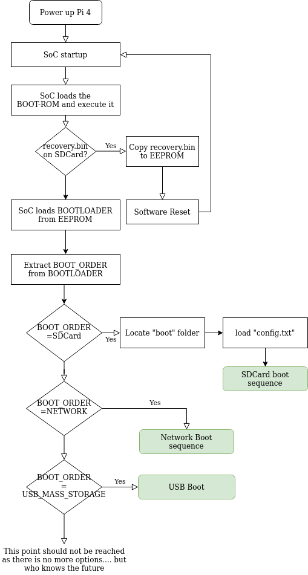

**Bootloaders and U-Boot**
=====================================
In this chapter we dive deep into the world of bootloaders—explaining what 
they are, why they are indispensable, and how they fit into the overall start-up 
sequence of an embedded system. You will build a simple custom bootloader 
step by step, gaining first-hand experience with the challenges and design 
decisions involved. Finally, we introduce U-Boot, the most widely used open-source 
bootloader in the embedded arena, and compare its capabilities with the minimalist 
loader you created earlier.

2.1 Bootloaders in Embedded Systems:
------------------------------------

As we say in chapter 1, **bootloader** is the first piece of
software—after immutable silicon code—that runs when power is applied.
Its mission is deceptively simple: **turn a blank, reset-state
microcontroller or SoC into a platform capable of running a full
operating system**.

2.1.1 Why Do We Need a Bootloader?
~~~~~~~~~~~~~~~~~~~~~~~~~~~~~~~~~~

1. **Hardware Initialisation** – Configure clocks, DRAM, MMU, caches,
   watchdogs.
2. **Peripheral Bring-up** – Enable UART, SPI, eMMC, Ethernet so the
   next stage can load images.
3. **Image Loading** – Locate the kernel (or second-stage loader) in
   flash, SD, QSPI, or over the network.
4. **Integrity / Security** – Verify cryptographic signatures, establish
   a chain of trust.
5. **Fallback & Recovery** – Provide safe-boot or factory reset if an
   update bricks the primary image.
6. **User Interaction** – Offer a CLI, LEDs, or a splash screen so
   engineers can debug or select boot targets.

2.1.2 Typical Tasks Performed by a modern bootloader:
~~~~~~~~~~~~~~~~~~~~~~~~~~~~~~~~~~~~~~~~~~~~~~~~~~~~~

+---------------------+----------------------+----------------------+
| Task                | Example on Raspberry | Why It Matters       |
|                     | Pi                   |                      |
+---------------------+----------------------+----------------------+
| DRAM calibration    | PLL & PHY training   | Kernel needs working |
|                     | by VideoCore         | RAM                  |
|                     | firmware             |                      |
+---------------------+----------------------+----------------------+
| Peripheral init     | Enable SD/eMMC, set  | Storage bus must be  |
|                     | GPIO ALT modes       | ready to read the    |
|                     |                      | kernel               |
+---------------------+----------------------+----------------------+
| Clock setup         | Switch from 19 MHz   | Performance & DVFS   |
|                     | crystal to > 1 GHz   |                      |
|                     | CPU                  |                      |
+---------------------+----------------------+----------------------+
| Image verification  | SHA-256 / RSA-2048   | Secure boot chain    |
|                     | in FIT image         |                      |
+---------------------+----------------------+----------------------+
| Device tree fix-ups | Patch MAC address    | Unique runtime data  |
|                     | into DTB             |                      |
+---------------------+----------------------+----------------------+
| Failsafe boot       | *bootcount* +        | Brick-proof OTA      |
|                     | alternate slot       |                      |
+---------------------+----------------------+----------------------+

2.1.4 Bootloader Diversity in the Wild
~~~~~~~~~~~~~~~~~~~~~~~~~~~~~~~~~~~~~~

+-------------------+-----------------------+-----------------------+
| Family            | Target Hardware       | Notable Features      |
+-------------------+-----------------------+-----------------------+
| **U-Boot**        | ARM, RISC-V, x86,     | Huge driver set,      |
|                   | MIPS                  | scripting, DFU, FIT   |
|                   |                       | images                |
+-------------------+-----------------------+-----------------------+
| **barebox**       | ARM, PPC, MIPS        | Linux-like API,       |
|                   |                       | kconfig menu, sandbox |
|                   |                       | tests                 |
+-------------------+-----------------------+-----------------------+
| **TF-A / OP-TEE** | ARMv8-A Secure World  | Trusted firmware &    |
|                   |                       | secure monitor        |
+-------------------+-----------------------+-----------------------+
| **Coreboot**      | x86/Chromebooks       | Open BIOS, fast boot, |
|                   |                       | depthcharge payload   |
+-------------------+-----------------------+-----------------------+

.. _section-3:

2.1.5 Where Does the Raspberry Pi Fit?
~~~~~~~~~~~~~~~~~~~~~~~~~~~~~~~~~~~~~~

-  Raspberry Pi uses an unusual split: **BootROM + GPU firmware**
   (proprietary) perform SPL duties.
-  Developers may **optionally replace the “kernel” with U-Boot** to
   gain flexibility, networking, and scripting.
-  The Pi’s EEPROM-based firmware can boot from SD, USB, or network
   without external flash—making *bare-metal* demos easy.

2.1.6 Key Takeaways
~~~~~~~~~~~~~~~~~~~

-  A bootloader’s main job is to **prepare hardware, verify code, and
   hand control to the OS**.
-  Most embedded boards follow a **ROM → tiny-loader → full-loader →
   kernel** progression.
-  **U-Boot** has become the de-facto open-source second-stage loader,
   but many alternatives exist.
-  Understanding this chain is critical before we configure, build, or
   troubleshoot U-Boot on the Raspberry Pi 4 in the next sections.

2.2 Raspberry pi boot chain:
----------------------------

The Raspberry Pi 4’s boot sequence is atypical among ARM boards because
it is orchestrated primarily by the **GPU** rather than the ARM cores.
Below is a concise refresher so you know exactly *who* boots *whom*

2.2.1 Boot Stages Explained
~~~~~~~~~~~~~~~~~~~~~~~~~~~

Below is a step-by-step explanation of what each stage does and **why it
exists**:

+-------------+-------------+-------------+-------------+-------------+
| Stage       | Size        | Stored In   | Respo       | What Can Go |
|             | (approx.)   |             | nsibilities | Wrong?      |
+-------------+-------------+-------------+-------------+-------------+
| **BootROM** | 32 KB       | Mask ROM    | • Check     | Har         |
|             |             | (SoC)       | boot-mode   | dware-level |
|             |             |             | pins•       | fault →     |
|             |             |             | Initialise  | board dead  |
|             |             |             | minimal     |             |
|             |             |             | SRAM• Clock |             |
|             |             |             | SD card and |             |
|             |             |             | read sector |             |
|             |             |             | 0x200       |             |
+-------------+-------------+-------------+-------------+-------------+
| **PI 4      | 100 KB      | SPI EEPROM  | • Bring up  | Corrupt     |
| EEPROM**    |             | (or SD on   | DDR4        | EEPROM →    |
|             |             | older Pi)   | controller• | green-LED   |
|             |             |             | Initialise  | pattern 1   |
|             |             |             | PMIC &      | long 4      |
|             |             |             | PLLs• Load  | short       |
|             |             |             | *           |             |
|             |             |             | start4.elf* |             |
|             |             |             | from FAT    |             |
+-------------+-------------+-------------+-------------+-------------+
| **s         | 3–5 MB      | FAT         | Parse       | Wrong       |
| tart4.elf** |             | partition   | config.txt  | overlay →   |
| *(GPU       |             |             | and run     | rainbow     |
| firmware)*  |             |             | .img file.  | splash / no |
|             |             |             |             | HDMI        |
+-------------+-------------+-------------+-------------+-------------+
| **B         | 1KB To 600  | FAT         | Run         | Bad         |
| ootLoader** | KB proper   | partition   | bootloader  | *bootcmd* → |
|             |             |             | script      | loop back   |
| *(u-Boot)*  |             |             | (.img)      | to prompt   |
|             |             |             | after call  |             |
|             |             |             | kernel      |             |
|             |             |             | entry       |             |
|             |             |             | function    |             |
|             |             |             | and pass    |             |
|             |             |             | dtb.        |             |
+-------------+-------------+-------------+-------------+-------------+
| **Linux     | 8–10 MB     | ext4 or FAT | • Setup     | Kernel      |
| Kernel**    | (Image)     |             | paging,     | panic,      |
|             |             |             | MMU, IRQs•  | rootfs not  |
|             |             |             | Initialise  | found       |
|             |             |             | drivers per |             |
|             |             |             | DTB• Mount  |             |
|             |             |             | rootfs•     |             |
|             |             |             | Launch PID  |             |
|             |             |             | 1           |             |
+-------------+-------------+-------------+-------------+-------------+

The journey from power-on to a blinking cursor involves several tightly
choreographed micro-steps:

-  **BootROM** is hard-wired logic. It tiniest tasks include clocking
   the SD controller at a safe speed, pulling the first sector (0x200)
   into an internal SRAM buffer, and verifying a small header. If
   anything fails here, the Pi shows a completely dark ACT LED.
-  **bootcode.bin**—now stored in EEPROM on Pi 4—switches on the DRAM,
   brings up the PMIC rails, and copies a much larger GPU firmware
   (*start4.elf*) to SDRAM. Its entire purpose is to do just enough
   initialisation so that the next, heavier stage can run from main
   memory.
-  **start4.elf** is closed-source VideoCore firmware. It parses
   *config.txt*, merges overlay files, sets up the frame-buffer splash
   if enabled, and ultimately decides what **kernel file** to load. By
   default that is *kernel8.img*, but you can override it with
   *kernel=my_image.img*.
-  When **U-Boot** is present it masquerades as the "kernel"
   (*kernel=u-boot.bin*). This optional stage gives us a powerful CLI,
   network booting, and scripting.
-  Finally, the real **Linux**\ **Image** is loaded. Regardless of
   U-Boot usage, the firmware (or U-Boot) copies it to physical address
   **0x80000** and jumps there in EL2 (or EL1) with the device-tree
   pointer in *x0*. That fixed entry point—0x0008_0000—explains why our
   bare-metal blink program must also link its *.text* there.

That fixed **0x80000 entry point**—hard-coded into the GPU
firmware—explains why both U-Boot and our bare-metal must link their
*.text* sections to start at that address.

With the Pi-specific boot chain firmly in mind, we are ready to explore
**bare-metal boots** and then dive deep into **building U-Boot** in the
following sections.

2.3 Create your own Bare metal bootloader Only:
-----------------------------------------------

As explained earlier, a Raspberry Pi 4 powers up in several distinct
stages. First, the on-chip **Boot ROM** runs a tiny stub that wakes the
VideoCore GPU. The GPU firmware then configures the ARM cores and
releases the primary core to execute code at address 0x80000. From that
moment the CPU expects to find a **bootloader**—a small program that
initializes only the devices the application truly needs and prepares
the scene for the operating system.

We will write a minimalist bootloader of our own and make it the very
first code the CPU runs after the GPU relinquishes control, giving us
complete authority over the board before the kernel starts.

2.3.1 Lab Overview – Crafting a *Minimal Bootloader* that Blinks an LED
~~~~~~~~~~~~~~~~~~~~~~~~~~~~~~~~~~~~~~~~~~~~~~~~~~~~~~~~~~~~~~~~~~~~~~~

In this exercise we **treat the blink program itself as a
micro-bootloader**. Instead of loading a full OS, the GPU jumps straight
into our hand-crafted *kernel8.img*, which executes a few instructions,
toggles the on-board LED, then loops forever.

*Lab 2.1 – Blink LED*

*GitHub repo:
https://github.com/ridhaos/MasteringEmbeddedLinux/tree/master/chapter2/Lab2.1*

**What you’ll learn**

-  How the Pi 4 firmware selects and jumps to *kernel8.img* (stage 4 of
   the boot chain).
-  How to craft a bare-metal binary that *conforms to the bootloader
   contract* (entry at *0x80000*, correct headers, ARM64 state).
-  The essentials of GPIO control directly from AArch64—a stepping-stone
   toward writing more capable second-stage loaders.

By the end you will know exactly **where the SoC lands after GPU
firmware** and how even a 512-byte image can count as a valid
“bootloader” if it obeys the calling conventions. Where We Sit in the
Boot Chain

Power-On \rightarrow BootROM \rightarrow bootcode.bin \rightarrow start4.elf \rightarrow\ **Our Bootloaders**

**Learning Goals:**

-  Understand how Raspberry Pi firmware loads a raw *kernel8.img*.
-  Get hands-on with *linker scripts* and the minimal AArch64 start-up
   sequence.
-  Manipulate GPIO registers.
-  Build confidence before tackling Linux Kernel.

2.3.2 High Level Steps:
~~~~~~~~~~~~~~~~~~~~~~~

Let’s begin first by creating directory:**myDirectory** where you will
work.

Create 4 files : **boot.S**, **main.c**, **link.ld** and **Makefile**.
under your directory to be like this :

-  myDirectory

   -  **boot.S**: Assembly boot sequence.
   -  **main.c**: Main program.
   -  **link.ld**: Linker to link file to 0x80000.
   -  **Makefile** : for compilation and image creation flow.

2.3.2.1 Create main.c:
^^^^^^^^^^^^^^^^^^^^^^

 *BCM2711 : Raspberry Pi soc datasheet:*
https://datasheets.raspberrypi.com/bcm2711/bcm2711-peripherals.pdf

.. code-block:: c

   #include <stdint.h>

   // Raspberry Pi 4 UART (PL011) and GPIO registers
   #define UART0_BASE  0xFE201000  // UART0 base address (RPi4)
   #define GPIO_BASE   0xFE200000  // GPIO base address (RPi4)

   // UART registers
   volatile uint32_t* UART0_DR     = (uint32_t*)(UART0_BASE + 0x00);  // Data register
   volatile uint32_t* UART0_FR     = (uint32_t*)(UART0_BASE + 0x18);  // Flag register
   volatile uint32_t* UART0_IBRD   = (uint32_t*)(UART0_BASE + 0x24);  // Integer baud rate divisor
   volatile uint32_t* UART0_FBRD   = (uint32_t*)(UART0_BASE + 0x28);  // Fractional baud rate divisor
   volatile uint32_t* UART0_LCRH   = (uint32_t*)(UART0_BASE + 0x2C);  // Line control register
   volatile uint32_t* UART0_CR     = (uint32_t*)(UART0_BASE + 0x30);  // Control register

   // GPIO registers
   volatile uint32_t* GPFSEL1      = (uint32_t*)(GPIO_BASE + 0x04);   // GPIO function select (for GPIO 16)
   volatile uint32_t* GPFSEL2      = (uint32_t*)(GPIO_BASE + 0x08);   // GPIO function select (for GPIO 21)
   volatile uint32_t* GPSET0       = (uint32_t*)(GPIO_BASE + 0x1C);   // GPIO set (turn ON)
   volatile uint32_t* GPCLR0       = (uint32_t*)(GPIO_BASE + 0x28);   // GPIO clear (turn OFF)

   #define LED_PIN   21u
   #define LED_MASK  (1u << LED_PIN)

   // Delays
   void delay(unsigned int count) {
      while (count--){
         __asm("NOP");
      }
   }

   // Initialize UART0 (115200 baud, 8N1)
   void uart_init() {
      *UART0_CR = 0;  // Disable UART

      // Set baud rate (115200)
      *UART0_IBRD = 26;  // Integer part
      *UART0_FBRD = 3;   // Fractional part

      // 8-bit, no parity, one stop bit (8N1)
      *UART0_LCRH = (1 << 4) | (1 << 5) | (1 << 6);

      // Enable UART (TX only)
      *UART0_CR = (1 << 0) | (1 << 8) | (1 << 9);
   }

   // Print a single character
   void uart_putc(char c) {
      while (*UART0_FR & (1 << 5));  // Wait if TX FIFO is full
      *UART0_DR = c;
   }

   // Print a string
   void uart_puts(const char* str) {
      while (*str) {
         uart_putc(*str++);
      }
   }

   // Main program
   void main() {
      // Initialize UART
      uart_init();
      uart_puts("Hello, bare-metal world!\r\n");

      // Set GPIO 16 as output
      *GPFSEL1 &= ~((7 << 12) | (7 << 15)); 
      *GPFSEL1 |=  ((4 << 12) | (4 << 15));   /* ALT0 = 100    */

      *GPFSEL2 &= ~(0b111u << ((LED_PIN % 10u) * 3u));
      *GPFSEL2 |=  (0b001u << ((LED_PIN % 10u) * 3u));
      // Blink LED forever
      while (1) {
         *GPSET0 = LED_MASK;  // Turn ON
         uart_puts("LED ON\r\n");
         delay(0xFFFFFF);

         *GPCLR0 = LED_MASK; // Turn OFF
         uart_puts("LED OFF\r\n");
         delay(0xFFFFFF);
      }
   }

Line-by-line explanation
------------------------

``#include <stdint.h>``
   Gives us fixed-width types (`uint32_t`) with **no** runtime overhead;
   perfectly safe even in freestanding code.

Register base defines
   *Pre-processor* constants vanish at compile-time – they never occupy
   RAM.  Every peripheral pointer is marked ``volatile`` so the compiler
   keeps each access.

``LED_PIN`` / ``LED_MASK``
   Abstract the magic number ``21`` and its bitmask
   ``0x0020 0000`` – easier to change later.

Delay loop
^^^^^^^^^^

.. code-block:: c

   while (count--) __asm__("nop");

A chain of ``nop`` instructions that stalls the core for a visible
interval.  **Accuracy is irrelevant** for an LED demo.

``uart_init()``
^^^^^^^^^^^^^^^

1. Disable the UART (`CR = 0`).
2. Program baud‐rate divisors − 48 MHz ÷ 16 ÷ (26 + 3/64) = 115 200.
3. 8-bit, no parity, one stop bit (`LCRH = 0b1110000`).
4. Re-enable transmit.

``uart_putc()`` / ``uart_puts()``
^^^^^^^^^^^^^^^^^^^^^^^^^^^^^^^^^

Poll the *TX-FIFO-full* flag (bit 5 of ``FR``) until clear, then write a
byte to ``DR``.  Polling is crude but adequate at a few chars per second.

Pin-muxing the peripherals
^^^^^^^^^^^^^^^^^^^^^^^^^^

=======================  ===============================  =========
Register / bits          Purpose                          Value
=======================  ===============================  =========
``GPFSEL1[14:15]``       Put GPIO 14 & 15 in **ALT0**     ``100b``
``GPFSEL2[21]``          Make GPIO 21 a plain output      ``001b``
=======================  ===============================  =========

Main loop
^^^^^^^^^

1. Write ``LED_MASK`` to **GPSET0** → LED high.  
2. ``uart_puts("LED ON")``.  
3. Busy-wait.  
4. Write ``LED_MASK`` to **GPCLR0** → LED low.  
5. ``uart_puts("LED OFF")``.  
6. Repeat forever.

Key take-aways
--------------

* *Memory-mapped I/O* means “write a value, hardware changes”.
* ``volatile`` prevents the optimiser from deleting essential reads /
  writes.
* Peripheral clocks on the Pi 4 are configured by earlier firmware, so
  we can talk UART immediately after reset.
* A *single* C source file can control real hardware—no OS, no
  libraries—by following the datasheet and using the right addresses.

2.4 Introduction U-Boot:
------------------------

History, design philosophy, and core features (CLI, scripting, drivers).

2.5 Building U-Boot for Raspberry Pi:
-------------------------------------

Step-by-step cross-compile (make rpi_4_defconfig), SPL vs U-Boot proper,
toolchain requirements.

2.6 Flashing and First boot test:
---------------------------------

Copying u-boot.bin via FAT partition, editing config.txt, and verifying
serial console output.

2.7 Navigating the U-Boot CLI:
------------------------------

Common commands (help, printenv, setenv, saveenv, load, booti, mw, md).

2.8 Environment Variables & Boot Scripts:
-----------------------------------------

Persistent env storage, boot.cmd → boot.scr, conditional logic, failsafe
boot.

2.9 Advanced Configuration Via *menuconfig*
-------------------------------------------

*Enabling USB, network, FIT images, DFU; creating a minimal custom
build.*

*2.10 Security & Signing Considerations*
----------------------------------------

*FIT image signatures, redundant SPL, anti-rollback strategies.*

*2.11 Troubleshooting U\ -\ Boot*
---------------------------------

*UART diagnostics, iminfo, bdinfo, common build/boot errors.*
