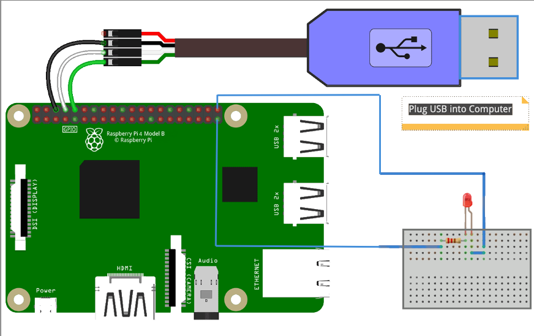

.. _chapter2-Bootloaders-uboot:

**Bootloaders and U-Boot**
=====================================
In this chapter we dive deep into the world of bootloaders explaining what 
they are, why they are indispensable, and how they fit into the overall start-up 
sequence of an embedded system. You will build a simple custom bootloader 
step by step, gaining first-hand experience with the challenges and design 
decisions involved. Finally, we introduce U-Boot, the most widely used open-source 
bootloader in the embedded arena, and compare its capabilities with the minimalist 
loader you created earlier.

2.1 Bootloaders in Embedded Systems:
------------------------------------

As we say in chapter 1, **bootloader** is the first piece of
software after immutable silicon code that runs when power is applied.
Its mission is deceptively simple: **turn a blank, reset-state
microcontroller or SoC into a platform capable of running a full
operating system**.

2.1.1 Why Do We Need a Bootloader?
~~~~~~~~~~~~~~~~~~~~~~~~~~~~~~~~~~~

1. **Hardware Initialisation**  - Configure clocks, DRAM, MMU, caches,
   watchdogs.
2. **Peripheral Bring-up**  - Enable UART, SPI, eMMC, Ethernet so the
   next stage can load images.
3. **Image Loading**  - Locate the kernel (or second-stage loader) in
   flash, SD, QSPI, or over the network.
4. **Integrity / Security**  - Verify cryptographic signatures, establish
   a chain of trust.
5. **Fallback & Recovery**  - Provide safe-boot or factory reset if an
   update bricks the primary image.
6. **User Interaction**  - Offer a CLI, LEDs, or a splash screen so
   engineers can debug or select boot targets.

2.1.2 Typical Tasks Performed by a modern bootloader:
~~~~~~~~~~~~~~~~~~~~~~~~~~~~~~~~~~~~~~~~~~~~~~~~~~~~~

+---------------------+----------------------+----------------------+
| Task                | Example on Raspberry | Why It Matters       |
|                     | Pi                   |                      |
+---------------------+----------------------+----------------------+
| DRAM calibration    | PLL & PHY training   | Kernel needs working |
|                     | by VideoCore         | RAM                  |
|                     | firmware             |                      |
+---------------------+----------------------+----------------------+
| Peripheral init     | Enable SD/eMMC, set  | Storage bus must be  |
|                     | GPIO ALT modes       | ready to read the    |
|                     |                      | kernel               |
+---------------------+----------------------+----------------------+
| Clock setup         | Switch from 19 MHz   | Performance & DVFS   |
|                     | crystal to > 1 GHz   |                      |
|                     | CPU                  |                      |
+---------------------+----------------------+----------------------+
| Image verification  | SHA-256 / RSA-2048   | Secure boot chain    |
|                     | in FIT image         |                      |
+---------------------+----------------------+----------------------+
| Device tree fix-ups | Patch MAC address    | Unique runtime data  |
|                     | into DTB             |                      |
+---------------------+----------------------+----------------------+
| Failsafe boot       | *bootcount* +        | Brick-proof OTA      |
|                     | alternate slot       |                      |
+---------------------+----------------------+----------------------+

2.1.4 Bootloader Diversity in the Wild
~~~~~~~~~~~~~~~~~~~~~~~~~~~~~~~~~~~~~~

+-------------------+-----------------------+-----------------------+
| Family            | Target Hardware       | Notable Features      |
+-------------------+-----------------------+-----------------------+
| **U-Boot**        | ARM, RISC-V, x86,     | Huge driver set,      |
|                   | MIPS                  | scripting, DFU, FIT   |
|                   |                       | images                |
+-------------------+-----------------------+-----------------------+
| **barebox**       | ARM, PPC, MIPS        | Linux-like API,       |
|                   |                       | kconfig menu, sandbox |
|                   |                       | tests                 |
+-------------------+-----------------------+-----------------------+
| **TF-A / OP-TEE** | ARMv8-A Secure World  | Trusted firmware &    |
|                   |                       | secure monitor        |
+-------------------+-----------------------+-----------------------+
| **Coreboot**      | x86/Chromebooks       | Open BIOS, fast boot, |
|                   |                       | depthcharge payload   |
+-------------------+-----------------------+-----------------------+

.. _section-3:

2.1.5 Where Does the Raspberry Pi Fit?
~~~~~~~~~~~~~~~~~~~~~~~~~~~~~~~~~~~~~~

-  Raspberry Pi uses an unusual split: **BootROM + GPU firmware**
   (proprietary) perform SPL duties.
-  Developers may **optionally replace the “kernel” with U-Boot** to
   gain flexibility, networking, and scripting.
-  The Pi's EEPROM-based firmware can boot from SD, USB, or network
   without external flash making *bare-metal* demos easy.

2.1.6 Key Takeaways
~~~~~~~~~~~~~~~~~~~

-  A bootloader's main job is to **prepare hardware, verify code, and
   hand control to the OS**.
-  Most embedded boards follow a **ROM → tiny-loader → full-loader →
   kernel** progression.
-  **U-Boot** has become the de-facto open-source second-stage loader,
   but many alternatives exist.
-  Understanding this chain is critical before we configure, build, or
   troubleshoot U-Boot on the Raspberry Pi 4 in the next sections.

2.2 Raspberry pi boot chain:
----------------------------

The Raspberry Pi 4's boot sequence is atypical among ARM boards because
it is orchestrated primarily by the **GPU** rather than the ARM cores.
Below is a concise refresher so you know exactly *who* boots *whom*

2.2.1 Boot Stages Explained
~~~~~~~~~~~~~~~~~~~~~~~~~~~

.. figure:: images/Pictures/10000000000001FD000003B76CE178BA1047CD8F.png
   :alt: 
   :width: 3.8516in
   :height: 7.1953in

Below is a step-by-step explanation of what each stage does and **why it
exists**:

+-------------+-------------+-------------+-------------+-------------+
| Stage       | Size        | Stored In   | Respo       | What Can Go |
|             | (approx.)   |             | nsibilities | Wrong?      |
+-------------+-------------+-------------+-------------+-------------+
| **BootROM** | 32 KB       | Mask ROM    | • Check     | Har         |
|             |             | (SoC)       | boot-mode   | dware-level |
|             |             |             | pins.       |             |
|             |             |             |             |             |
|             |             |             |•Initialise  | fault →     |
|             |             |             | minimal     | board dead  |
|             |             |             | SRAM• Clock |             |
|             |             |             | SD card and |             |
|             |             |             | read sector |             |
|             |             |             | 0x200       |             |
|             |             |             |             |             |
+-------------+-------------+-------------+-------------+-------------+
| **PI 4      | 100 KB      | SPI EEPROM  | • Bring up  | Corrupt     |
| EEPROM**    |             | (or SD on   | DDR4        | EEPROM →    |
|             |             | older Pi)   | controller  |             |
|             |             |             |             | green-LED   |
|             |             |             | •Initialise | pattern 1   |
|             |             |             | PMIC &      | long 4      |
|             |             |             | PLLs• Load  | short       |
|             |             |             | *           |             |
|             |             |             | start4.elf* |             |
|             |             |             | from FAT    |             |
+-------------+-------------+-------------+-------------+-------------+
| **s         | 3 -5 MB     | FAT         | Parse       | Wrong       |
| tart4.elf** |             | partition   | config.txt  | overlay →   |
| *(GPU       |             |             | and run     | rainbow     |
| firmware)*  |             |             | .img file.  | splash / no |
|             |             |             |             | HDMI        |
+-------------+-------------+-------------+-------------+-------------+
| **B         | 1KB To 600  | FAT         | Run         | Bad         |
| ootLoader** | KB proper   | partition   | bootloader  | *bootcmd* → |
|             |             |             | script      | loop back   |
| *(u-Boot)*  |             |             | (.img)      | to prompt   |
|             |             |             | after call  |             |
|             |             |             | kernel      |             |
|             |             |             | entry       |             |
|             |             |             | function    |             |
|             |             |             | and pass    |             |
|             |             |             | dtb.        |             |
+-------------+-------------+-------------+-------------+-------------+
| **Linux     | 8 -10 MB    | ext4 or FAT | • Setup     | Kernel      |
| Kernel**    | (Image)     |             | paging,     | panic,      |
|             |             |             | MMU, IRQs•  | rootfs not  |
|             |             |             | Initialise  | found       |
|             |             |             | drivers per |             |
|             |             |             | DTB• Mount  |             |
|             |             |             | rootfs•     |             |
|             |             |             | Launch PID  |             |
|             |             |             | 1           |             |
+-------------+-------------+-------------+-------------+-------------+

The journey from power-on to a blinking cursor involves several tightly
choreographed micro-steps:

-  **BootROM** is hard-wired logic. It tiniest tasks include clocking
   the SD controller at a safe speed, pulling the first sector (0x200)
   into an internal SRAM buffer, and verifying a small header. If
   anything fails here, the Pi shows a completely dark ACT LED.
-  **bootcode.bin** now stored in EEPROM on Pi 4 switches on the DRAM,
   brings up the PMIC rails, and copies a much larger GPU firmware
   (*start4.elf*) to SDRAM. Its entire purpose is to do just enough
   initialisation so that the next, heavier stage can run from main
   memory.
-  **start4.elf** is closed-source VideoCore firmware. It parses
   *config.txt*, merges overlay files, sets up the frame-buffer splash
   if enabled, and ultimately decides what **kernel file** to load. By
   default that is *kernel8.img*, but you can override it with
   *kernel=my_image.img*.
-  When **U-Boot** is present it masquerades as the "kernel"
   (*kernel=u-boot.bin*). This optional stage gives us a powerful CLI,
   network booting, and scripting.
-  Finally, the real **Linux**\ **Image** is loaded. Regardless of
   U-Boot usage, the firmware (or U-Boot) copies it to physical address
   **0x80000** and jumps there in EL2 (or EL1) with the device-tree
   pointer in *x0*. That fixed entry point 0x0008_0000 explains why our
   bare-metal blink program must also link its *.text* there.

That fixed **0x80000 entry point** hard-coded into the GPU
firmware explains why both U-Boot and our bare-metal must link their
*.text* sections to start at that address.

With the Pi-specific boot chain firmly in mind, we are ready to explore
**bare-metal boots** and then dive deep into **building U-Boot** in the
following sections.

2.3 Create your own Bare metal bootloader Only:
-----------------------------------------------

As explained earlier, a Raspberry Pi 4 powers up in several distinct
stages. First, the on-chip **Boot ROM** runs a tiny stub that wakes the
VideoCore GPU. The GPU firmware then configures the ARM cores and
releases the primary core to execute code at address 0x80000. From that
moment the CPU expects to find a **bootloader** a small program that
initializes only the devices the application truly needs and prepares
the scene for the operating system.

We will write a minimalist bootloader of our own and make it the very
first code the CPU runs after the GPU relinquishes control, giving us
complete authority over the board before the kernel starts.

2.3.1 Lab Overview  - Crafting a *Minimal Bootloader* that Blinks an LED
~~~~~~~~~~~~~~~~~~~~~~~~~~~~~~~~~~~~~~~~~~~~~~~~~~~~~~~~~~~~~~~~~~~~~~~~~~

In this exercise we **treat the blink program itself as a
micro-bootloader**. Instead of loading a full OS, the GPU jumps straight
into our hand-crafted *kernel8.img*, which executes a few instructions,
toggles the on-board LED, then loops forever.

*Lab 2.1  - Blink LED*

*GitHub repo:
https://github.com/ridhaos/MasteringEmbeddedLinux/tree/master/chapter2/Lab2.1*

**What you'll learn**

-  How the Pi 4 firmware selects and jumps to *kernel8.img* (stage 4 of
   the boot chain).
-  How to craft a bare-metal binary that *conforms to the bootloader
   contract* (entry at *0x80000*, correct headers, ARM64 state).
-  The essentials of GPIO control directly from AArch64 a stepping-stone
   toward writing more capable second-stage loaders.

By the end you will know exactly **where the SoC lands after GPU
firmware** and how even a 512-byte image can count as a valid
“bootloader” if it obeys the calling conventions. Where We Sit in the
Boot Chain

Power-On \rightarrow BootROM \rightarrow bootcode.bin \rightarrow start4.elf \rightarrow\ **Our Bootloaders**

**Learning Goals:**

-  Understand how Raspberry Pi firmware loads a raw *kernel8.img*.
-  Get hands-on with *linker scripts* and the minimal AArch64 start-up
   sequence.
-  Manipulate GPIO registers.
-  Build confidence before tackling Linux Kernel.

2.3.2 High Level Steps:
~~~~~~~~~~~~~~~~~~~~~~~

Let's begin first by creating directory:**myDirectory** where you will
work.

Create 4 files : **boot.S**, **main.c**, **link.ld** and **Makefile**.
under your directory to be like this :

-  myDirectory

   -  **boot.S**: Assembly boot sequence.
   -  **main.c**: Main program.
   -  **link.ld**: Linker to link file to 0x80000.
   -  **Makefile** : for compilation and image creation flow.

Start by main program :
^^^^^^^^^^^^^^^^^^^^^^^

 *BCM2711 : Raspberry Pi soc datasheet:*
https://datasheets.raspberrypi.com/bcm2711/bcm2711-peripherals.pdf

.. code-block:: c

   #include <stdint.h>

   // Raspberry Pi 4 UART (PL011) and GPIO registers
   #define UART0_BASE  0xFE201000  // UART0 base address (RPi4)
   #define GPIO_BASE   0xFE200000  // GPIO base address (RPi4)

   // UART registers
   volatile uint32_t* UART0_DR     = (uint32_t*)(UART0_BASE + 0x00);  // Data register
   volatile uint32_t* UART0_FR     = (uint32_t*)(UART0_BASE + 0x18);  // Flag register
   volatile uint32_t* UART0_IBRD   = (uint32_t*)(UART0_BASE + 0x24);  // Integer baud rate divisor
   volatile uint32_t* UART0_FBRD   = (uint32_t*)(UART0_BASE + 0x28);  // Fractional baud rate divisor
   volatile uint32_t* UART0_LCRH   = (uint32_t*)(UART0_BASE + 0x2C);  // Line control register
   volatile uint32_t* UART0_CR     = (uint32_t*)(UART0_BASE + 0x30);  // Control register

   // GPIO registers
   volatile uint32_t* GPFSEL1      = (uint32_t*)(GPIO_BASE + 0x04);   // GPIO function select (for GPIO 16)
   volatile uint32_t* GPFSEL2      = (uint32_t*)(GPIO_BASE + 0x08);   // GPIO function select (for GPIO 21)
   volatile uint32_t* GPSET0       = (uint32_t*)(GPIO_BASE + 0x1C);   // GPIO set (turn ON)
   volatile uint32_t* GPCLR0       = (uint32_t*)(GPIO_BASE + 0x28);   // GPIO clear (turn OFF)

   #define LED_PIN   21u
   #define LED_MASK  (1u << LED_PIN)

   // Delays
   void delay(unsigned int count) {
      while (count--){
         __asm("NOP");
      }
   }

   // Initialize UART0 (115200 baud, 8N1)
   void uart_init() {
      *UART0_CR = 0;  // Disable UART

      // Set baud rate (115200)
      *UART0_IBRD = 26;  // Integer part
      *UART0_FBRD = 3;   // Fractional part

      // 8-bit, no parity, one stop bit (8N1)
      *UART0_LCRH = (1 << 4) | (1 << 5) | (1 << 6);

      // Enable UART (TX only)
      *UART0_CR = (1 << 0) | (1 << 8) | (1 << 9);
   }

   // Print a single character
   void uart_putc(char c) {
      while (*UART0_FR & (1 << 5));  // Wait if TX FIFO is full
      *UART0_DR = c;
   }

   // Print a string
   void uart_puts(const char* str) {
      while (*str) {
         uart_putc(*str++);
      }
   }

   // Main program
   void main() {
      // Initialize UART
      uart_init();
      uart_puts("Hello, bare-metal world!\r\n");

      // Set GPIO 16 as output
      *GPFSEL1 &= ~((7 << 12) | (7 << 15)); 
      *GPFSEL1 |=  ((4 << 12) | (4 << 15));   /* ALT0 = 100    */

      *GPFSEL2 &= ~(0b111u << ((LED_PIN % 10u) * 3u));
      *GPFSEL2 |=  (0b001u << ((LED_PIN % 10u) * 3u));
      // Blink LED forever
      while (1) {
         *GPSET0 = LED_MASK;  // Turn ON
         uart_puts("LED ON\r\n");
         delay(0xFFFFFF);

         *GPCLR0 = LED_MASK; // Turn OFF
         uart_puts("LED OFF\r\n");
         delay(0xFFFFFF);
      }
   }

Line-by-line explanation
^^^^^^^^^^^^^^^^^^^^^^^^^^^

``#include <stdint.h>``
   Gives us fixed-width types (`uint32_t`) with **no** runtime overhead;
   perfectly safe even in freestanding code.

Register base defines
   *Pre-processor* constants vanish at compile-time  - they never occupy
   RAM.  Every peripheral pointer is marked ``volatile`` so the compiler
   keeps each access.

``LED_PIN`` / ``LED_MASK``
   Abstract the magic number ``21`` and its bitmask
   ``0x0020 0000``  - easier to change later.

Delay loop
^^^^^^^^^^

.. code-block:: c

   while (count--) __asm__("nop");

A chain of ``nop`` instructions that stalls the core for a visible
interval.  **Accuracy is irrelevant** for an LED demo.

``uart_init()``
^^^^^^^^^^^^^^^

1. Disable the UART (`CR = 0`).
2. Program baud-rate divisors - 48 MHz ÷ 16 ÷ (26 + 3/64) = 115 200.
3. 8-bit, no parity, one stop bit (`LCRH = 0b1110000`).
4. Re-enable transmit.

``uart_putc()`` / ``uart_puts()``
^^^^^^^^^^^^^^^^^^^^^^^^^^^^^^^^^

Poll the *TX-FIFO-full* flag (bit 5 of ``FR``) until clear, then write a
byte to ``DR``.  Polling is crude but adequate at a few chars per second.

Pin-muxing the peripherals
^^^^^^^^^^^^^^^^^^^^^^^^^^

=======================  ===============================  =========
Register / bits          Purpose                          Value
=======================  ===============================  =========
``GPFSEL1[14:15]``       Put GPIO 14 & 15 in **ALT0**     ``100b``
``GPFSEL2[21]``          Make GPIO 21 a plain output      ``001b``
=======================  ===============================  =========

Main loop
^^^^^^^^^

1. Write ``LED_MASK`` to **GPSET0** → LED high.  
2. ``uart_puts("LED ON")``.  
3. Busy-wait.  
4. Write ``LED_MASK`` to **GPCLR0** → LED low.  
5. ``uart_puts("LED OFF")``.  
6. Repeat forever.

Key take-aways
^^^^^^^^^^^^^^^^^^

* *Memory-mapped I/O* means “write a value, hardware changes”.
* ``volatile`` prevents the optimiser from deleting essential reads
  writes.
* Peripheral clocks on the Pi 4 are configured by earlier firmware, so
  we can talk UART immediately after reset.
* A *single* C source file can control real hardware no OS, no
  libraries by following the datasheet and using the right addresses.

.. _baremetal-startup-stub:

The start-up stub in ``start.S``
^^^^^^^^^^^^^^^^^^^^^^^^^^^^^^^^^^^^

Before the C function :c:func:`main` can run, the CPU needs **one**
absolutely minimal bit of assembly: a *reset handler* that sets up a
stack and jumps into C.  That is what the file ``start.S`` provides.

**Source listing:**

.. code-block:: asm
   :linenos:

      /* start.S  - minimal AArch64 bootstrap for Raspberry Pi 4 */

      .section .text
      .global _start
   _start:
      ldr   x0, =_stack_top        // 1  load top-of-stack address
      mov   sp, x0                 // 2  establish SP
      bl    main                   // 3  call C entry point

   1: b     1b                     // 4  dead-end loop if main returns

      /* ---------- reserve 8 KiB for the stack ---------- */
      .section .bss
      .align  11                   // 2¹¹ = 2048-byte alignment
   _stack:
      .skip   8192                 // 8 KiB of zero-filled RAM
   _stack_top:

Line-by-line explanation
^^^^^^^^^^^^^^^^^^^^^^^^^^

#. ``.section .text``  
   Selects the *text* section machine instructions that will end up in
   ROM / flash / SD card.

#. ``.global _start``  
   Exports the label so the linker can make it the ELF entry point
   (declared in :file:`linker.ld` via ``ENTRY(_start)``).

#. ``ldr x0, =_stack_top``  
   A PC-relative literal load: the assembler encodes the *address* of
   :token:`_stack_top` directly into the instruction stream. This keeps
   the code position-independent.

#. ``mov sp, x0``  
   Copies that address into the *stack pointer* (``sp``). From now on
   the C compiler can emit pushes, pops, local variables, and so on.

#. ``bl main``  
   “*Branch and link*” saves a return address in ``x30`` and jumps to the
   first C function. In a bare-metal program we never expect to return,
   but the instruction is convenient because most ABIs assume
   :c:func:`main` is called   not jumped to.

#. ``1: b 1b``
   A local label ``1`` followed by ``b 1b`` (*b*ack to the most recent
   label “1”).  If :c:func:`main` ever returns, the CPU lands here and
   enters an infinite spin instead of fetching random memory.

Stack reservation in ``.bss``
^^^^^^^^^^^^^^^^^^^^^^^^^^^^^

* ``.section .bss`` switches to the *bss* section, which the linker
  initialises to zero at load time.
* ``.align 11`` forces a 2 KiB alignment   helpful if you later enable
  the data cache.
* ``.skip 8192`` carves out **8 KiB** of space, enough for simple
  interrupt frames and nested function calls.
* ``_stack_top`` is the **label** whose address we loaded into ``sp``.

Key take-aways
^^^^^^^^^^^^^^^^

* **Just three instructions** (load, move, branch) turn a powered-up
  Cortex-A72 into a C-friendly environment.
* The stack lives in ``.bss`` so it does **not** inflate the final
  *kernel8.img*; the firmware zeroes the region on load.
* All addresses are **link-time symbols**; no magic numbers appear in
  the code.
* If you later add exception vectors, MMU setup, or a second core, they
  grow *above* this stub the reset handler itself rarely changes.

.. _baremetal-linker-make:

Now it time to explain  - ``linker.ld`` and ``Makefile``
^^^^^^^^^^^^^^^^^^^^^^^^^^^^^^^^^^^^^^^^^^^^^^^^^^^^^^^^^

With **main.c** and **start.S** written, we still need two build-system
artifacts:

* a *linker script* (``linker.ld``) that places each section at the
  address the Raspberry Pi firmware expects, and
* a *Makefile* that turns the sources into two deliverables:
  an ELF file for debugging and a raw ``kernel8.img`` for the SD card.

Both files are tiny but essential. This section explains them line by
line.

-------------------------------------------------------------------------------

The linker script  - ``linker.ld``
^^^^^^^^^^^^^^^^^^^^^^^^^^^^^^^^^^^^

.. code-block:: c
   :linenos:

      /* linker.ld  - layout for Raspberry Pi 4 bare-metal images */

      ENTRY(_start)                 /* where objdump -d starts */

      SECTIONS
      {
          . = 0x80000;              /* Pi 4 firmware jumps here */

          /* ---- code + constants ------------------------------------ */
          .text : {
              KEEP(*(.text._start)) /* force reset stub to the front    */
              *(.text*)             /* the rest of .text                */
              *(.rodata*)           /* string literals, const tables    */
          }

          /* ---- initialised data ------------------------------------ */
          .data : {
              *(.data*)
          }

          /* ---- zero-initialised data + our 8 KiB stack ------------- */
          .bss : {
              *(.bss*)
              *(COMMON)
          }
      }

Explanation of linker.ld
^^^^^^^^^^^^^^^^^^^^^^^^^^^

* **Line 1  -** comment only; useful in large projects.
* **Line 3 (`ENTRY`)**  - names the symbol the ELF header marks as the
  program's entry point. ``objcopy`` keeps that information, so the
  debugger can still “run” the ELF even though the Pi firmware ignores
  it.
* **Line 6 (`. = 0x80000;`)**  - sets the location counter; the first
  byte that follows will land at **0x0008 0000**, the hard-coded load
  address for ``kernel8.img``.
* **Lines 9 -12**  - the optional ``KEEP`` directive prevents the linker
  from discarding ``_start`` if you ever turn on “gc-sections”.
* **Lines 18 -21**  - ``.bss`` collects *all* zero-initialised variables
  **plus** the 8 KiB stack we reserved in ``start.S``.  Because it sits
  in ``.bss`` the binary on disk does **not** inflate only a size field
  in the header grows.

Key take-aways
^^^^^^^^^^^^^^^^

* A one-liner ``. = 0x80000`` is usually the only Pi-specific change
  you need; the rest is standard GNU ld syntax.
* ``KEEP`` is insurance: regardless of object-file order, the reset
  stub is the **very first** bytes the CPU sees.

-------------------------------------------------------------------------------

The build recipe  - ``Makefile``
^^^^^^^^^^^^^^^^^^^^^^^^^^^^^^^^^

.. code-block:: make
   :linenos:

      # Makefile  - build kernel8.img for bare-metal Raspberry Pi 4
      CROSS   ?= aarch64-linux-gnu
      CFLAGS  = -O2 -ffreestanding -nostdlib -mcpu=cortex-a72
      ASFLAGS = -c -mcpu=cortex-a72

      SRC_C   = blink.c
      SRC_S   = start.S
      OBJ     = start.o blink.o      # start.o **first** = safe order
      ELF     = blink.elf
      IMG     = kernel8.img

      all: $(IMG)

      %.o: %.c
      	$(CROSS)-gcc $(CFLAGS) -c $< -o $@

      %.o: %.S
      	$(CROSS)-as $(ASFLAGS) $< -o $@

      $(ELF): $(OBJ) linker.ld
      	$(CROSS)-ld -T linker.ld -o $@ $(OBJ)

      $(IMG): $(ELF)
      	$(CROSS)-objcopy -O binary $< $@

      clean:
      	rm -f $(OBJ) $(ELF) $(IMG)

Explanation of Makefile
^^^^^^^^^^^^^^^^^^^^^^^^^

Variable block (lines 1-8)
  * ``CROSS``  - lets readers override the triplet with
    ``make CROSS=aarch64-none-elf`` if they prefer a different tool-chain.
  * ``-ffreestanding -nostdlib``  - tells GCC *no* start-files, *no*
    ``libc``.
  * ``-mcpu=cortex-a72``  - optimises code and emits the correct SIMD
    feature bits.

Rules (lines 10-25)

+-------------------------+--------------------------------------------------------------------+
| Target                  | What happens                                                       |
+-------------------------+--------------------------------------------------------------------+
| **pattern rules (%.o)** | Compile or assemble a single source file into an object file.      |
+-------------------------+--------------------------------------------------------------------+
| **``blink.elf``**       | Link objects with the custom script.                               |
+-------------------------+--------------------------------------------------------------------+
| **``kernel8.img``**     | Strip the ELF into a flat binary no headers, no alignment padding. |
+-------------------------+--------------------------------------------------------------------+
| **``make clean``**      | Delete everything that can be regenerated.                         |
+-------------------------+--------------------------------------------------------------------+

Why **`start.o` first**?
  Object order decides *section order* unless the linker script says
  otherwise.  Placing the reset stub first keeps ``_start`` at
  0x80000 even if someone removes the ``KEEP`` directive later.

Key take-aways
^^^^^^^^^^^^^^^^

* A *three-step* build compile, link, objcopy is all you need for
  bare-metal projects.
* Prefix every tool with ``$(CROSS)`` so the same Makefile works on
  Windows, macOS, or Linux as long as a cross-compiler is in ``$PATH``.
* ``kernel8.img`` is the **only** file the Pi firmware cares about; the
  ELF is for humans and debuggers.

-------------------------------------------------------------------------------

With **``start.S``**, **``linker.ld``** and **``Makefile``** in place,
running ::

   $ make CROSS_COMPILE=aarch64-linux-gnu-

produces ``kernel8.img`` ready to copy onto the SD card alongside
``start4.elf`` and ``fixup4.dat``.  Power-cycle the board your LED
blinks and the UART greets you, proof that the entire build chain is
correct.

Let's test our kernel8.img
^^^^^^^^^^^^^^^^^^^^^^^^^^^
In github repository you will find:
   * fixup4.dat
   * start4.elf
   * config.txt

copy those files and add kernel*.img to FAT SD card after preparing SD card before.
**See annexe how to prepare your sd card for raspberrypi 4.**

Now connect Led with 220Ohm to Pin 40 (GPIO21), and connect TTL3v3 uart
to Laptop and run :

.. code-block:: bash

   minicom --device /dev/ttyUSB0 --baudrate 115200

Power On raspberrypi and let the magic take you, Take time to understand
what we did and how led start blinking. Enjoy !!

   Figure 5: Raspberry 4 schematic.

2.3.3  Looking Ahead
~~~~~~~~~~~~~~~~~~~~~~

Our bare-metal LED blinker has done its job: you have proved that any
binary the firmware places at **0x80000** can act as a bootloader.
A real-world product, however, needs much more than a single LED 
storage drivers, networking, upgrade hooks, even a user-facing shell.

Writing all of that from scratch would be heroic *and* slow.  
Instead, the embedded community leans on the open-source powerhouse
**U-Boot**.  In the next section we will:

* **Build U-Boot** for the Raspberry Pi 4.  
* **Explore** its interactive CLI and powerful scripting engine.  
* **Watch** it load a Linux kernel, Device Tree, and optional *initramfs*
  with a single command.

Grab your serial cable the journey is about to shift from a 512-byte
demo to a feature-rich boot environment that supports hand-off,
recovery, and rapid iteration.

2.4 Introduction U-Boot:
------------------------

Among all bootloaders available today, **Das U-Boot** (universal bootloader) has emerged 
as the dominant solution, particularly in the ARM ecosystem.

U-Boot serves as the critical bridge between hardware initialization and 
operating system launch, performing essential functions like:

* Hardware initialization (CPU, memory, clocks)
* Loading the operating system kernel from storage or network
* Providing a pre-boot environment for configuration and debugging
* Supporting secure boot and verification processes

What makes U-Boot remarkable is its combination of:

- **Portability** (runs on nearly every architecture)
- **Flexibility** (supports countless storage and boot methods)
- **Robustness** (battle-tested on thousands of boards)
- **Community support** (backed by major silicon vendors)

Before we build and flash our own U-Boot image, let's examine how this 
open-source project became the de facto standard for embedded systems worldwide.

2.4.1 A Short History & Motivation:
~~~~~~~~~~~~~~~~~~~~~~~~~~~~~~~~~~~~~~

* **1999** - "PPCBoot" started as a PowerPC-only loader for embedded boards.
* **2002** - Renamed "Das U-Boot" (German for The Boot) when ARM, MIPS, and x86 support were merged.
* **2004-2010** - Added FAT/ext, USB, networking stacks, scripting, NAND/UBI.
* **2012+** - Adopted Linux-style kconfig build system; SPL concept formalised; FIT image signatures, DFU, and device model introduced.

Today U-Boot supports 2500+ boards across ARM, RISC-V, x86, MIPS, PowerPC, and even FPGA soft-cores.

2.4.2 U-Boot Advantage:
~~~~~~~~~~~~~~~~~~~~~~~~~~~~

U-Boot has become the dominant bootloader in embedded systems due to several key advantages:

.. list-table:: Capabilities
   :header-rows: 1
   :widths: 20 80

   * - **Capability**
     - **Why It Matters in Embedded Development**
   * - **Unified CLI**
     - Same commands (``load``/``booti``/``printenv``) work everywhere
   * - **Rich driver set**
     - Supports SD/eMMC, USB, Ethernet, SPI-NOR, I²C, PCIe
   * - **Script Engine**
     - Conditional logic inside ``boot.scr``
   * - **Networking**
     - TFTP, NFS, DHCP, BOOTP for headless ops
   * - **SPL + tertiary loader**
     - Tiny (<40 KB) SPL sets up DRAM then jumps to U-Boot
   * - **Secure Boot**
     - FIT signing (RSA/ECDSA)
   * - **Menuconfig build**
     - Familiar ``make menuconfig`` UI

These capabilities make U-Boot uniquely suited for embedded development across diverse hardware platforms.

.. _sec-u-boot-comparison:

2.4.3 U-Boot vs Other Bootloaders
~~~~~~~~~~~~~~~~~~~~~~~~~~~~~~~~~~

+------------+-------------------------------+-----------+-------------------------------+
| **Feature**| **U-Boot**                    | **barebox** | **TF-A (Trusted Firmware)** |
+============+===============================+===========+===============================+
| Target     | First + second stage,         | Same,      | Secure Monitor (BL31)        |
| scope      | interactive shell             | Linux-like | only                         |
|            |                               | API        |                              |
+------------+-------------------------------+------------+------------------------------+
| CLI &      | Yes                           | Yes        | Minimal                      |
| scripting  |                               |            |                              |
+------------+-------------------------------+------------+------------------------------+
| Build      | *kconfig*                     | *kconfig*  | CMake                        |
| config     |                               |            |                              |
+------------+-------------------------------+------------+------------------------------+
| Secure     | FIT image-signing (RSA/ECDSA) | Raw SHA/   | Primary **raison d'être**    |
| Boot       | + TEE hooks                   | RSA hooks  |                              |
+------------+-------------------------------+------------+------------------------------+
| Raspberry  | Mature, actively maintained   | Community  | N/A                          |
| Pi status  |                               | port only  |                              |
+------------+-------------------------------+------------+------------------------------+

.. tip::

   Need a quick feature check?  Type ``help`` at the U-Boot prompt;
   every compiled-in command is listed.

2.4.4 U-Boot SPL concept:
~~~~~~~~~~~~~~~~~~~~~~~~~~~

In U-Boot, SPL(Secondery Program Loader) is crucial concept, especially in systems with
limited boot memory (like embedded devices).

#. **What is SPL ?** : 
   * SPL is stripped down version of U-Boot that runs before the main U-Boot.
   * It is responsible for *Basic Hardware Initialisation* and loading the full U-Boot.

#. **What use SPL ?** : 
   * Memory constraints.
   * Faster boot time.

2.4.5 Why Choose U-Boot for Raspberry Pi 4?
~~~~~~~~~~~~~~~~~~~~~~~~~~~~~~~~~~~~~~~~~~~~

#. **Community support** - the ``rpi_4_defconfig`` is kept up-to-date in
   mainline; patches land quickly.
#. **Feature parity** - USB-MSC boot, *ext4*, TFTP, and the network console
   all work *without* proprietary blobs.
#. **Scriptable recovery** - implement A/B fallback in a one-line
   ``bootcmd`` snippet.
#. **Scalability** - the same build recipe covers Pi Zero 2 W, CM4, and
   future boards.

2.4.6 What We'll Do Next
~~~~~~~~~~~~~~~~~~~~~~~~~

* **Build** U-Boot with an external cross-toolchain.
* **Flash** it by copying ``u-boot.bin`` to the FAT partition and tweaking
  ``config.txt``.
* **Explore** the CLI - memory pokes (``md``, ``mw``), image loading
  (``fatload``, ``tftpboot``) and kernel launch (``booti``).
* **Persist** environment variables in EEPROM or SD.
* **Secure** the boot chain with basic FIT-image signing.

.. admonition:: Ready?

   Grab your serial cable—next up is :ref:`sec-build-uboot`
   where we compile and run U-Boot on the Pi 4.

.. _sec-build-uboot:

2.5 Building U-Boot for Raspberry Pi:
-------------------------------------

This section turns the theory from 2.4 into practice.  
We compile mainline **U-Boot**, integrate a *bare-metal* LED-blink
payload linked at **0x00200000**, and produce ready-to-boot files for the
Pi 4.

.. contents::
   :local:
   :depth: 2

2.5.1 Prerequisites
~~~~~~~~~~~~~~~~~~~~

* **Host OS** - Ubuntu 22.04 LTS (any modern Linux works)
* **Packages**

  .. code-block:: bash

     $ sudo apt update
     $ sudo apt install gcc-aarch64-linux-gnu \
                        make git build-essential \
                        libssl-dev bison flex bc

* **Cross-compiler triplet**  
  Throughout this chapter we use

  .. code-block:: bash

     CROSS_COMPILE=aarch64-linux-gnu-

  Feel free to substitute a pre-built toolchain (Linaro, ARM GNU, etc.).

* **Clone the sources**

  .. code-block:: bash

     $ git clone https://github.com/ridhaos/MasteringEmbeddedLinux.git
     $ git clone https://source.denx.de/u-boot/u-boot.git

2.5.2 Repository Layout & Helper Files
~~~~~~~~~~~~~~~~~~~~~~~~~~~~~~~~~~~~~~~

The lab directory lives under:

::

   chapter2/
   └─ Lab2.2/
      ├─ blink/              # bare-metal payload
      │  ├─ main.c
      │  ├─ linker.ld        # linked at 0x00200000
      │  └─ Makefile
      ├─ run.sh              # one-shot build helper
      └─ u-boot/             # cloned mainline U-Boot

.. _lab22-makefile:

Let's start by explain *Makefile*:

**blink/Makefile** (excerpt)
^^^^^^^^^^^^^^^^^^^^^^^^^^^^

.. literalinclude:: ../../chapter2/Lab2.2/blink/Makefile
   :language: make
   :lines: 1-30

Key lines:

* ``CROSS_COMPILE`` — forwarded from the parent script.
* ``LDFLAGS := -T linker.ld`` — ensures the payload starts at **0x00200000**.
* ``arm-none-eabi-objcopy -O binary`` — produces a raw
  *blink.bin* ready for SD card.

**What is ``rpi_4_defconfig``?**
^^^^^^^^^^^^^^^^^^^^^^^^^^^^^^^^

Mainline U-Boot keeps *board presets* in ``configs/``.  
The target we use:

::

   configs/rpi_4_defconfig

enables:

* 64-bit ARM (AArch64) build
* Minimal SPL + full U-Boot proper
* USB, SD/eMMC, *ext4*, FAT, network (ETH PHY) drivers
* Default console on PL011 UART at 115 200 bps

Invoke it with:

.. code-block:: bash

   $ make rpi_4_defconfig

to populate ``.config`` with all Pi-4-specific options.

.. _lab22-run-script:

**run.sh** - One-Shot Builder
^^^^^^^^^^^^^^^^^^^^^^^^^^^^^

.. literalinclude:: ../../chapter2/Lab2.2/run.sh
   :language: bash
   :emphasize-lines: 13,20,26

The script:

#. Exports common flags (``ARCH=arm64 CROSS_COMPILE=…``).  
#. Builds **blink.bin** with the Makefile above.  
#. Builds **U-Boot** with *rpi_4_defconfig* on all host cores.  
#. Drops **u-boot.bin** and **blink.bin** in the lab root for easy copying.

.. note::

   Only *one* address changed from Lab 2·1 —  
   ``linker.ld`` now we remove ``_start`` flag at **0x0020 0000**
   and replace it  with main.

2.5.3 Compiling U-Boot & the Payload
~~~~~~~~~~~~~~~~~~~~~~~~~~~~~~~~~~~~~

.. code-block:: bash

   $ cd chapter2/Lab2.2
   $ ./run.sh

Expected artefacts:

::

   blink.bin   #  3.6 KiB  - bare-metal LED blinker
   u-boot.bin  # ~1.3 MiB  - full U-Boot for Pi 4

Verify the entry addresses:

.. code-block:: bash

   $ aarch64-linux-gnu-nm -h blink.elf

Look for ``main`` around *0x0020 0000*.

2.5.4 Deploying to the SD Card
~~~~~~~~~~~~~~~~~~~~~~~~~~~~~~~~

#. Mount the Pi's FAT partition (e.g. ``/media/$USER/BOOT``).  
#. Copy both binaries:

   .. code-block:: bash

      $ cp blink.bin  /media/$USER/BOOT
      $ cp u-boot.bin /media/$USER/BOOT

#. Edit *config.txt*:

   .. code-block:: text

      arm_64bit=1
      enable_uart=1
      kernel=u-boot.bin

Power-cycle the board and open the serial console.  
At the U-Boot prompt:

.. code-block:: bash

   => load mmc 0:1 ${loadaddr} blink.bin
   => go ${loadaddr}

A heartbeat LED confirms the custom payload runs before the kernel.

Common Pitfalls
^^^^^^^^^^^^^^^^

+---------------------------+-------------------------------------------------+
| **Symptom**               | **Fix**                                         |
+===========================+=================================================+
| Solid red power LED only  | Check SD wiring, rename *kernel8.img* back if   |
|                           | the Pi's EEPROM is too old for *kernel=*.       |
+---------------------------+-------------------------------------------------+
| ``Bad ELF magic`` in      | You copied the *ELF* output, not *blink.bin*.   |
| U-Boot                    | Use ``objcopy -O binary`` artefact.             |
+---------------------------+-------------------------------------------------+

2.5.5 What's Next?
~~~~~~~~~~~~~~~~~~~~

Now that **U-Boot boots reliably** and can launch an arbitrary
bare-metal blob, we move on to *interactive exploration*:

* Navigating the CLI  
* Persisting environment variables  
* Booting a full **Linux kernel** from SD, USB, or TFTP

Continue with :ref:`sec-flash-firstboot`.

.. _sec-flash-firstboot:

2.6 Flashing and First boot test:
---------------------------------

With **U-Boot** and your custom *blink.bin* payload compiled, the next step
is to drop both files onto an SD-card, power-up the Pi 4, and verify that
everything works.

2.6.1 Prepare the SD Card
~~~~~~~~~~~~~~~~~~~~~~~~~~

#. **Erase / format** the card as FAT-32 (the Pi's first-stage firmware
   requires a FAT partition).

#. **Mount** it on the host, e.g. ``/media/$USER/BOOT``.

#. **Copy** the artefacts built in :ref:`chapter2-Bootloaders-uboot`:

   .. code-block:: bash

      cp blink.bin  /media/$USER/BOOT
      cp u-boot.bin /media/$USER/BOOT

   **Resulting directory layout**

   +----------------+-------------------------------+
   | File           | Purpose                       |
   +================+===============================+
   | **u-boot.bin** | Second-stage bootloader       |
   +----------------+-------------------------------+
   | **blink.bin**  | Bare-metal LED payload at     |
   |                | 0x00200000 (Lab 2.2)          |
   +----------------+-------------------------------+
   | config.txt     | Tells the GPU firmware which  |
   |                | binary to load                |
   +----------------+-------------------------------+

2.6.2 Edit *config.txt*
~~~~~~~~~~~~~~~~~~~~~~~~~

Append (or modify) the following keys:

.. code-block:: text

   # --- Lab 2.2 U-Boot + Blink ------------------
   arm_64bit=1
   enable_uart=1         # serial console on GPIO14/15
   kernel=u-boot.bin     # hand control to U-Boot
   #----------------------------------------------

Save **config.txt**, unmount the card, and insert it into the Pi 4.

.. note::

   Older EEPROM firmware may ignore ``kernel=``.  
   If you see no serial output, update the EEPROM with the official
   ``rpi-eeprom-update`` tool (see § 2.2.1).

2.6.3 First Power-Up
~~~~~~~~~~~~~~~~~~~~~

Connect a **3.3 V serial cable** (115 200 N 8 1) to GPIO 14 / 15, then:

.. code-block:: bash

   sudo minicom -b 115200 -D /dev/ttyUSB0 

Power on the Pi 4:

::

   U-Boot 2024.01 (Jul 6 2025 - 14:42:15 +0000)  RPi_4
   DRAM:  886 MiB (effective 3.8 GiB)
   RPI 4 Model B (0xc03114)
   Core:  213 devices, 17 uclasses, devicetree: board
   MMC:   mmcnr@7e300000: 1, mmc@7e340000: 0
   Loading Environment from FAT... Unable to read "uboot.env" from mmc0:1... 
   In:    serial,usbkbd
   Out:   serial,vidconsole
   Err:   serial,vidconsole
   Net:   eth0: ethernet@7d580000
   …
   Hit any key to stop autoboot:  2 ⏳ 1 ⏳ 0
   =>

If you see the prompt, U-Boot is alive and reading ``u-boot.bin`` from
the FAT partition.

2.6.4 Launch the Blink Payload
~~~~~~~~~~~~~~~~~~~~~~~~~~~~~~~~~~

Still at the ``=>`` prompt:

.. code-block:: bash

   => load mmc 0:1 ${loadaddr} blink.bin
   => go ${loadaddr}

*GPIO 21* should toggle at ~1 Hz.  
(No LED? Confirm the board revision or use a scope on the pin.)

2.6.5 Quick Recovery Tips
~~~~~~~~~~~~~~~~~~~~~~~~~~

+------------------------------+----------------------------------+
| **Symptom**                  | **Action**                       |
+==============================+==================================+
| UART shows **“`Bad ELF`”**   | You copied the wrong file—use    |
|                              | *blink.bin* (raw binary).        |
+------------------------------+----------------------------------+
| Green ACT LED blinks 4x long | ``kernel=u-boot.bin`` missing    |
| then 4x short                | or bad SD; double-check FAT32.   |
+------------------------------+----------------------------------+
| Nothing on UART              | Out-of-date EEPROM; update it    |
|                              | per the Raspberry Pi docs.       |
+------------------------------+----------------------------------+

2.6.6 What's Next?
~~~~~~~~~~~~~~~~~~~

Now that **U-Boot** boots and can chain-load a bare-metal blob, the next
logical step is to **explore the CLI**, store environment variables, and
ultimately boot a full **Linux** image.

Continue with :ref:`sec-uboot-cli` to discover the U-Boot command
interface in depth.

2.7 Navigating the U-Boot CLI:
------------------------------

Common commands (help, printenv, setenv, saveenv, load, booti, mw, md).

2.8 Environment Variables & Boot Scripts:
-----------------------------------------

Persistent env storage, boot.cmd → boot.scr, conditional logic, failsafe
boot.

2.9 Advanced Configuration Via *menuconfig*
-------------------------------------------

*Enabling USB, network, FIT images, DFU; creating a minimal custom
build.*

*2.10 Security & Signing Considerations*
----------------------------------------

*FIT image signatures, redundant SPL, anti-rollback strategies.*

*2.11 Troubleshooting U\ -\ Boot*
---------------------------------

*UART diagnostics, iminfo, bdinfo, common build/boot errors.*
